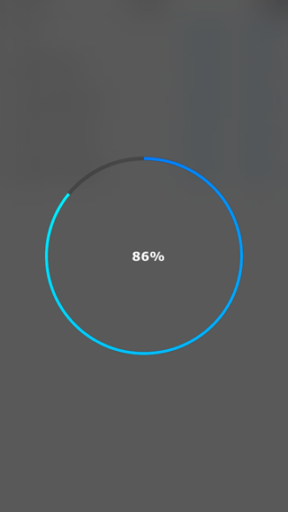
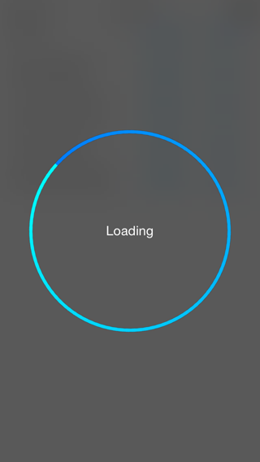
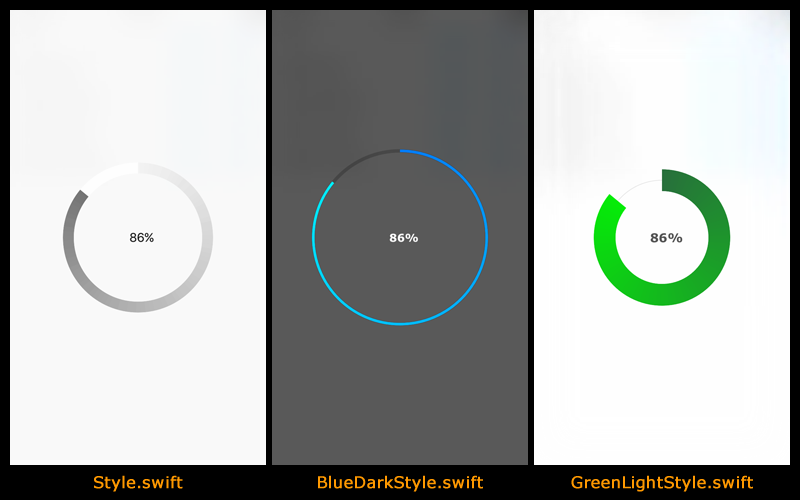
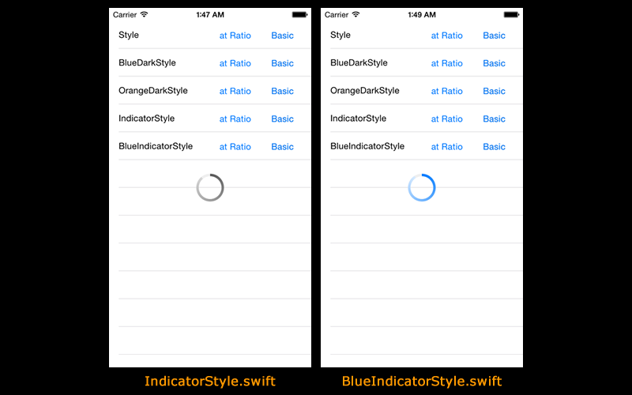
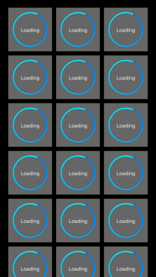
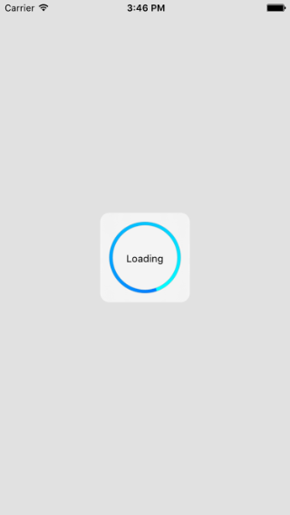
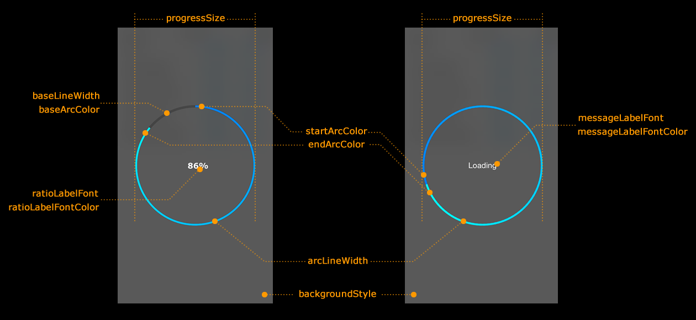
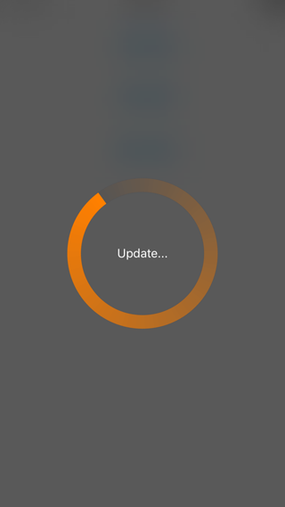

# Gradient Circular Progress

Customizable progress indicator library in Swift

## Requirements
- Swift 4.1
- iOS 8.0 or later

## Screen Shots

- Preset style: [BlueDarkStyle.swift](https://github.com/keygx/GradientCircularProgress/blob/master/Source/BlueDarkStyle.swift)

  

- All preset styles

 
 

- Example Use AddSubView

  

## Installation

###Carthage

* Cartfile

```Cartfile
github "keygx/GradientCircularProgress"
```
or

```Cartfile
github "keygx/GradientCircularProgress" "branch-name"
```
or

```Cartfile
github "keygx/GradientCircularProgress" "tag"
```

* install

```
$ carthage update
```


To integrate "GradientCircularProgress.framework" into your Xcode project

###CocoaPods

* PodFile [Sample/PodFile]

```PodFile
platform :ios, '8.0'

target '<Your Target Name>' do
    use_frameworks!
    
    pod 'GradientCircularProgress', :git => 'https://github.com/keygx/GradientCircularProgress'
    
    post_install do |installer|
        installer.pods_project.targets.each do |target|
            target.build_configurations.each do |config|
                config.build_settings['SWIFT_VERSION'] = '4.1'
            end
        end
    end
    
end
```
or

```PodFile
platform :ios, '8.0'

target '<Your Target Name>' do
    use_frameworks!
    
    pod 'GradientCircularProgress', :git => 'https://github.com/keygx/GradientCircularProgress', :branch => 'branch-name'
    
    post_install do |installer|
        installer.pods_project.targets.each do |target|
            target.build_configurations.each do |config|
                config.build_settings['SWIFT_VERSION'] = '4.1'
            end
        end
    end
    
end
```
or

```PodFile
platform :ios, '8.0'

target '<Your Target Name>' do
    use_frameworks!
    
    pod 'GradientCircularProgress', :git => 'https://github.com/keygx/GradientCircularProgress', :tag => 'tag'
    
    post_install do |installer|
        installer.pods_project.targets.each do |target|
            target.build_configurations.each do |config|
                config.build_settings['SWIFT_VERSION'] = '4.1'
            end
        end
    end
    
end
```

* install

```
$ pod install
```

## Style Settings

Please make your original styles



- Define custom style structs that implements the StyleProperty Protocol

[MyStyle.swift](https://github.com/keygx/GradientCircularProgress/blob/master/Sample/MyStyle.swift)

```swift
import GradientCircularProgress

public struct MyStyle : StyleProperty {
    /*** style properties **********************************************************************************/
    
    // Progress Size
    public var progressSize: CGFloat = 200
    
    // Gradient Circular
    public var arcLineWidth: CGFloat = 18.0
    public var startArcColor: UIColor = UIColor.clear()
    public var endArcColor: UIColor = UIColor.orange()
    
    // Base Circular
    public var baseLineWidth: CGFloat? = 19.0
    public var baseArcColor: UIColor? = UIColor.darkGray()
    
    // Ratio
    public var ratioLabelFont: UIFont? = UIFont(name: "Verdana-Bold", size: 16.0)
    public var ratioLabelFontColor: UIColor? = UIColor.white()
    
    // Message
    public var messageLabelFont: UIFont? = UIFont.systemFont(ofSize: 16.0)
    public var messageLabelFontColor: UIColor? = UIColor.white()
    
    // Background
    public var backgroundStyle: BackgroundStyles = .dark
    
    // Dismiss
    public var dismissTimeInterval: Double? = 0.0 // 'nil' for default setting.
    
    /*** style properties **********************************************************************************/
    
    public init() {}
}

```



## Usage
```swift
import GradientCircularProgress
```
### Basic
#### UIWindow
```swift
let progress = GradientCircularProgress()

progress.show(message: "Loading...", MyStyle())

progress.dismiss()
```
#### addSubView
```swift
let progress = GradientCircularProgress()

let progressView = progress.show(frame: rect, message: "Loading...", style: MyStyle())
view.addSubview(progressView!)

progress.dismiss(progress: progressView!)
```

### at Rtio
#### UIWindow
```swift
let progress = GradientCircularProgress()

let ratio: CGFloat = CGFloat(totalBytesWritten) / CGFloat(totalBytesExpectedToWrite)        
progress.showAtRatio(style: MyStyle())

progress.updateRatio(ratio)

progress.dismiss()
```
#### addSubView
```swift
let progress = GradientCircularProgress()

let progressView = progress.showAtRatio(frame: rect, display: true, style: MyStyle())
view.addSubview(progressView!)

progress.updateRatio(ratio)

progress.dismiss(progress: progressView!)
```

### Update Message
#### UIWindow
```swift
let progress = GradientCircularProgress()

progress.show(message: "Download\n0 / 4", MyStyle())

progress.updateMessage(message: "Download\n1 / 4")
progress.updateMessage(message: "Download\n2 / 4")
progress.updateMessage(message: "Download\n3 / 4")
progress.updateMessage(message: "Download\n4 / 4")
progress.updateMessage(message: "Completed!")

progress.dismiss()
```
#### addSubView
```swift
let progress = GradientCircularProgress()

let progressView = progress.show(frame: rect, message: "Download\n0 / 4", style: MyStyle())
view.addSubview(progressView!)

progress.updateMessage(message: "Download\n1 / 4")
progress.updateMessage(message: "Download\n2 / 4")
progress.updateMessage(message: "Download\n3 / 4")
progress.updateMessage(message: "Download\n4 / 4")
progress.updateMessage(message: "Completed!")

progress.dismiss(progress: progressView!)
```

## API
### Use UIWindow
```swift
public func showAtRatio(display: Bool = true, style: StyleProperty = Style())

public func show(style: StyleProperty = Style())

public func show(message: String, style: StyleProperty = Style())

public func dismiss()

public func dismiss(_ completionHandler: () -> Void) -> ()
```

### Use addSubView
```swift
public func showAtRatio(frame: CGRect, display: Bool = true, style: StyleProperty = Style()) -> UIView?

public func show(frame: CGRect, style: StyleProperty = Style()) -> UIView?

public func show(frame: CGRect, message: String, style: StyleProperty = Style()) -> UIView?

public func dismiss(progress view: UIView)

public func dismiss(progress view: UIView, completionHandler: () -> Void) -> ()
```

### Common
```swift
public func updateMessage(message message: String)

public func updateRatio(_ ratio: CGFloat)
```

## License

Gradient Circular Progress is released under the MIT license. See LICENSE for details.

## Author

Yukihiko Kagiyama (keygx) <https://twitter.com/keygx>

